# Automated Four-Point Probe Measurement System

A Python-based automated measurement system that combines a **Thorlabs KVS30/M Vertical Stage** with an **Ossila/xtralien Four-Point Probe** for precise electrical characterization of thin films. This system automates the process of sheet resistance and electrical conductivity measurements.


---

## ✨ Features

- **Automated Stage Control** – Precisely moves sample to contact position using Thorlabs Kinesis motor
- **Contact Verification** – Automatically verifies probe-sample contact before measurement
- **I-V Curve Measurement** – Performs voltage sweeps and measures current response
- **Sheet Resistance Calculation** – Computes R<sub>s</sub> using the standard four-point probe correction factor
- **Electrical Conductivity** – Calculates conductivity (σ) from sheet resistance and film thickness
- **Data Export** – Saves results as CSV files with timestamped filenames
- **Visualization** – Generates I-V curve plots as PNG images

---

## 🔧 Hardware Requirements

| Component | Model | Description |
|-----------|-------|-------------|
| **Vertical Stage** | Thorlabs KVS30/M | Vertical translation stage with 30mm travel |
| **Four-Point Probe** | Ossila SMU + Probe | Source Measure Unit with four-point probe head |
| **Computer** | Linux PC | USB connections for both devices |

### Default Port Configuration (Linux)

```
Thorlabs Stage:    /dev/ttyUSB0
Four-Point Probe:  /dev/ttyACM0
```

---

## 📦 Software Requirements

### Dependencies

```bash
pip install pylablib xtralien numpy matplotlib
```

| Package | Purpose |
|---------|---------|
| `pylablib` | Thorlabs Kinesis motor control |
| `xtralien` | Ossila SMU communication |
| `numpy` | Numerical calculations |
| `matplotlib` | I-V curve plotting |

---

## 🚀 Quick Start

### 1. Clone the Repository

```bash
git clone https://github.com/S8bin-dev/AutomatedProbing.git
cd AutomatedProbing
```

### 2. Set Up Virtual Environment (Recommended)

```bash
python3 -m venv venv
source venv/bin/activate
pip install -r requirements.txt
```

### 3. Grant Device Permissions (Linux)

```bash
sudo chmod 666 /dev/ttyUSB0
sudo chmod 666 /dev/ttyACM0
```

### 4. Verify Connections & Home Stage

```bash
python3 check_connection.py
```

This script will:
- Connect to both devices
- Home the Thorlabs stage (if not already homed)
- Verify four-point probe communication

### 5. Run Measurement

**For sheet resistance only:**
```bash
python3 main.py
```

**For sheet resistance + electrical conductivity:**
```bash
python3 get_conductivity.py
```

---

## 📁 Project Structure

```
AutomatedProbing/
├── main.py                # Main measurement script (sheet resistance)
├── get_conductivity.py    # Extended script (includes conductivity calculation)
├── check_connection.py    # Device verification and stage homing
├── results_automated/     # Output folder for CSV and PNG results
├── venv/                  # Python virtual environment
├── .gitignore             # Git ignore file
└── README.md              # This file
```

---

## ⚙️ Configuration Parameters

All configuration parameters are defined at the top of `main.py` and `get_conductivity.py`:

### Device Ports
```python
STAGE_PORT = '/dev/ttyUSB0'    # Thorlabs stage serial port
PROBE_PORT = '/dev/ttyACM0'    # Ossila probe serial port
```

### Stage Settings
```python
CONTACT_HEIGHT_MM = 5.4        # Height where probe contacts sample (mm)
STEPS_PER_MM = 34304           # Motor steps per millimeter
SETTLING_TIME = 1.0            # Wait time after reaching position (seconds)
```

### Measurement Settings
```python
START_V = -0.5                 # Voltage sweep start (V)
END_V = 0.5                    # Voltage sweep end (V)
STEP_V = 0.02                  # Voltage step size (V)
CURRENT_LIMIT = 0.2            # Maximum current (A)
```

### Contact Verification
```python
TEST_VOLTAGE = 0.1             # Voltage for contact test (V)
CONTACT_THRESHOLD = 0.0001     # Minimum current for good contact (A)
RETRY_INCREMENT_MM = 0.1       # Height increment on retry (mm)
```

### Calculations
```python
CORRECTION_FACTOR = 4.532      # Four-point probe geometry correction
```

---

## 📊 Output Files

Results are saved to the `results_automated/` folder with the format:

```
{SampleName}_{YYYY-MM-DD_HH-MM-SS}.csv
{SampleName}_{YYYY-MM-DD_HH-MM-SS}.png
```

### CSV Format

| Column | Unit | Description |
|--------|------|-------------|
| Current (A) | Amperes | Measured current |
| Voltage (V) | Volts | Measured voltage |
| Sheet Resistance (Ohm/sq) | Ω/□ | Calculated R<sub>s</sub> |
| Conductivity (S/m) | S/m | Electrical conductivity (get_conductivity.py only) |

---

## 🔬 Measurement Workflow

```mermaid
graph TD
    A[Start] --> B[Enter Sample Name]
    B --> C[Connect Devices]
    C --> D[Move to Contact Height]
    D --> E[Verify Contact]
    E -->|Good Contact| F[Run I-V Sweep]
    E -->|Poor Contact| G{User Choice}
    G -->|Retry| H[Increase Height +0.1mm]
    H --> E
    G -->|Abort| I[Return Home]
    G -->|Override| F
    F --> J[Calculate Rs & σ]
    J --> K[Save CSV & Plot]
    K --> L[Return Home]
    L --> M[Shutdown]
```



---

## 🛠️ Troubleshooting

### Stage Not Connecting

```bash
# Check if device exists
ls -la /dev/ttyUSB*

# Grant permissions
sudo chmod 666 /dev/ttyUSB0

# If device is busy, unplug and replug USB
```

### Probe Not Connecting

```bash
# Check if device exists
ls -la /dev/ttyACM*

# Grant permissions
sudo chmod 666 /dev/ttyACM0

# Ensure no other application is using the probe
```

### Stage Not Homed Error

Always run `check_connection.py` before running measurements. This ensures the stage is properly homed.

### Poor Contact Detection

1. Check that the sample is properly positioned under the probe
2. Ensure the probe tips are clean and making contact
3. Increase `CONTACT_HEIGHT_MM` if consistently getting poor contact
4. Use the retry option to incrementally raise the stage

---

## 📈 Example Results

After a successful measurement, you'll see output like:

```
RESULTS SUMMARY
----------------------------------------
Average Sheet Resistance: 15.42 Ω/sq
Average Conductivity:     6.49e+04 S/m
----------------------------------------
```

---

## 🪟 Windows Compatibility

For Windows systems, update the port configurations:

```python
STAGE_PORT = 'COM3'    # Check Device Manager for actual port
PROBE_PORT = 'COM4'    # Check Device Manager for actual port
```

---

## 📜 License

This project is licensed under the MIT License - see the [LICENSE](LICENSE) file for details.

---

## 🤝 Contributing

Contributions, issues, and feature requests are welcome! Feel free to open an issue or submit a pull request.

---

## 📬 Contact

**Author:** Sabin  
**GitHub:** [@S8bin-dev](https://github.com/S8bin-dev)

---

<p align="center">
  Made with ❤️ for materials science research
</p>
